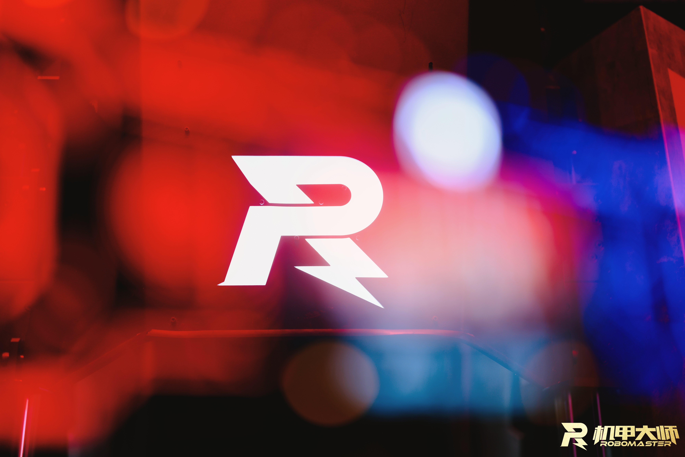

# QDU Future Hardware

### 未来战队 · 硬件组
极致心之砺往，勇者燃梦未来

[浏览仓库](https://github.com/orgs/QDU-Future-Hardware/repositories) · [联系我们](mailto:conconcare@outlook.com)

---

## 关于我们

这里是未来战队硬件组的 GitHub 主页，用于整理和分享战队的硬件工程、嵌入式固件与配套设计资源。

我们希望把研发过程中的设计、代码与经验留在这里，让项目更易协作，也让后续迭代有迹可循。

## 项目导航

| 项目 | 内容 |
| :--- | :--- |
| [WEILAI_SuperCap_software](https://github.com/QDU-Future-Hardware/WEILAI_SuperCap_software) | 超级电容软件子项目，包含基于 STM32G474 的固件与 CAN 通讯说明 |
| [Bullet_Charger](https://github.com/QDU-Future-Hardware/Bullet_Charger) | 未来战队 2027 赛季自研荧光充能，包含 KiCad 原理图、PCB 及生产文件 |
| [Symbols_Packages_Library](https://github.com/QDU-Future-Hardware/Symbols_Packages_Library) | 元件符号与封装库，内容待补充 |

> 仓库仍在持续建设中，具体接口、硬件版本和使用方式请以各项目 README 及最新提交为准。

## 技术与方向

`KiCad` · `STM32` · `C / C++` · `CAN / FDCAN` · `电源电子` · `PCB 设计`

## 交流与协作

欢迎通过对应仓库的 Issue 交流问题、提出建议，也欢迎提交 Pull Request。

描述问题或提交改动时，请尽量附上：

- 使用的硬件版本、固件版本及开发环境；
- 问题现象、复现步骤或修改目的；
- 相关测试结果、日志或波形。

各项目的使用方式与接口说明，请以对应仓库的文档为准。

## 联系

[conconcare@outlook.com](mailto:conconcare@outlook.com)
